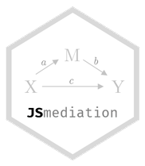

<!-- README.md is generated from README.Rmd. Please edit that file -->

# JSmediation 

[](https://cran.r-project.org/package=JSmediation)
[](https://github.com/cedricbatailler/JSmediation/actions)
[](https://codecov.io/github/cedricbatailler/JSmediation?branch=master)

`JSmediation` is an R package aiming to provide a set of functions to
conduct mediation analysis joint-significance tests. The goal of
`JSmediation` is to provide a consistent syntax to conduct
joint-significance tests.

This is motivated by the fact that joint-significance tests perform
better in terms of false positive rate control than other tests like
bootstrap-based methods (Yzerbyt, Muller, Batailler, & Judd, 2018). To
do so, it provides a family of `mdt_*` functions helping one conducting
different mediation analysis.

Current implemented models are:

-   simple mediation (`mdt_simple`)
-   within-participant mediation (`mdt_within`, but see also
    `mdt_within_wide`)
-   moderated mediation (`mdt_moderated`)

Every `mdt_*` functions take at least four arguments: `data` (the data
frame containing the data to be used),`IV` (the unquoted column name of
the independent variable in the data frame), `DV` (the unquoted column
name of the dependent variable in the data frame), and `M` (the unquoted
column name of the mediator in the data frame).

## Installation

You can install the released version of JSmediation from
[CRAN](https://CRAN.R-project.org) with:

``` r
install.packages("JSmediation")
```

You can install the development version from
[GitHub](https://github.com/) with:

``` r
# install.packages("devtools")
devtools::install_github("cedricbatailler/JSmediation", build_vignettes = TRUE)
```

## How to use JSmediation

``` r
library(JSmediation)
```

The `JSmediation` package contains several functions as well as example
data sets that can be used as an example. The `ho_et_al` data set comes
from Ho et al. (2017; Exp. 3) and contains variables to test a simple
mediation. As a simple example, we will conduct a joint-significance
test of the indirect effect of discrimination on hypodescent passing by
linked fate.

We will first recode `condition` variable which is a character to a
contrast code using the `build_contrast` function.

``` r
data("ho_et_al")

ho_et_al$condition_c <- build_contrast(ho_et_al$condition, 
                                       "High discrimination",
                                       "Low discrimination")

head(ho_et_al)
#>   id           condition    sdo linkedfate hypodescent condition_c
#> 1  2  Low discrimination 1.8125      6.000    2.333333         0.5
#> 2  3 High discrimination 1.5625      5.875    6.000000        -0.5
#> 3  4 High discrimination 1.7500      6.625    6.000000        -0.5
#> 4  5  Low discrimination 4.2500      5.125    5.666667         0.5
#> 5  6  Low discrimination 1.9375      4.375    4.000000         0.5
#> 6  9 High discrimination 2.8750      3.750    4.000000        -0.5
```

Now, we can conduct a joint significant test using the `mdt_simple`
function.

``` r
JS_model <- mdt_simple(ho_et_al, 
                       DV = hypodescent, 
                       IV = condition_c, 
                       M  = linkedfate)

JS_model
#> Test of mediation (simple mediation)
#> ==============================================
#> 
#> Variables:
#> 
#> - IV: condition_c 
#> - DV: hypodescent 
#> - M: linkedfate 
#> 
#> Paths:
#> 
#> ====  ==============  =====  =======================
#> Path  Point estimate     SE  APA                    
#> ====  ==============  =====  =======================
#> a             -0.772  0.085  t(822) = 9.10, p < .001
#> b              0.187  0.033  t(821) = 5.75, p < .001
#> c             -0.171  0.081  t(822) = 2.13, p = .034
#> c'            -0.027  0.083  t(821) = 0.33, p = .742
#> ====  ==============  =====  =======================
#> 
#> Indirect effect index:
#> 
#> Indirect effect index is not computed by default.
#> Please use add_index() to compute it.
#> 
#> Fitted models:
#> 
#> - X -> Y 
#> - X -> M 
#> - X + M -> Y
```

One will have to make sure that both *a* and *b* are significant to
conclude that there is a mediation pattern.

### References

Yzerbyt, V., Muller, D., Batailler, C., & Judd, C. M. (2018). New
recommendations for testing indirect effects in mediational models: The
need to report and test component paths. *Journal of Personality and
Social Psychology*, *115*(6), 929–943. doi:
[10.1037/pspa0000132](https://dx.doi.org/10.1037/pspa0000132)

Ho, A. K., Kteily, N. S., & Chen, J. M. (2017). “You’re one of us”:
Black Americans’ use of hypodescent and its association with
egalitarianism. *Journal of Personality and Social Psychology*,
*113*(5), 753-768. doi:
[10.1037/pspi0000107](https://dx.doi.org/10.1037/pspi0000107)

## Contributing

Contributions are absolutely welcome. Please note that this project is
released with a [Contributor Code of
Conduct](https://github.com/cedricbatailler/JSmediation/blob/master/CODE_OF_CONDUCT.md).

By participating in this project you agree to abide by its terms.
